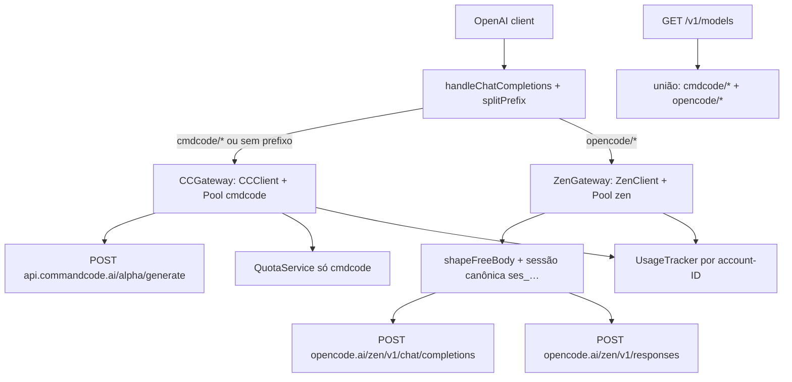

# cliai2api-gateways Design

**Spec**: `.specs/features/cliai2api-gateways/spec.md`
**Status**: Approved — Execute in progress (T1–T3 done; GW-03b/GW-07 incorporados em 2026-09-22)

---

## Architecture Overview

Interface `Gateway` com um `AccountPool` próprio por gateway. O handler faz parse do prefixo (`cmdcode/` default, `opencode/`), remove o prefixo e delega ao gateway. `CCClient` é adaptado como primeiro `Gateway`; `ZenClient` é o segundo. Catálogos por gateway são unidos com prefixo no `GET /v1/models`.



---

## Code Reuse Analysis

### Existing Components to Leverage

| Component | Location | How to Use |
| --------- | -------- | ---------- |
| `AccountPool` (round-robin, cooldown 429, failover) | `internal/app/accounts.go` | Uma instância por gateway; caminho Zen usa semântica `isNonRetryableClientResponse` (402 não-retryable + `MarkSuccess`, resto igual ao cmdcode — GW-03, issues §5) |
| `CCClient.Send/doSend/normalizeUpstreamError` | `internal/app/cc.go` | Vira `CCGateway`; `Send` mantém assinatura interna, ganha wrapper de interface |
| `openAIToCC`, `messagesToCC`, `toolsToCC`, SSE `parseStreamEvents` + `normalizer` | `internal/app/cc.go`, `events.go` | Reuso intacto no caminho cmdcode |
| `handleStream/handleNonStream` (OpenAI SSE out) | `internal/app/handler.go` | Reuso para os 3 caminhos (cmdcode, zen-chat, zen-responses traduzido) |
| `UsageTracker.RecorderFor` (contadores por account-ID) | `internal/app/usage.go` | IDs derivam da key (`accountID()`); mesma key em gateways distintos colidiria → namespacing (ver Riscos) |
| `authMiddleware`, `adminAuth`, `ClientKeyPool` | `internal/app/server.go`, `clientkeys.go` | Intactos; client keys seguem gateway-agnósticas |
| `QuotaService` | `internal/app/quota.go` | Só cmdcode no MVP; Zen sem quota (out of scope) |
| `loadConfig/saveConfig/defaultConfig` | `internal/app/config.go` | Estender + migração legada |
| `registerAdminRoutes` | `internal/app/admin.go` | Adicionar dimensão `gateway` no CRUD de contas |
| Recon estático do referência (shaping, sessão, 402, Playground) | `.spec/issues.md` §1–§2, §5, §13 | Especifica GW-03b/GW-03-AC3/GW-07 sem executar o referência |

### Integration Points

| System | Integration Method |
| ------ | ------------------ |
| Command Code upstream | `CCGateway` = `CCClient` atual renomeado; `base_url` default `https://api.commandcode.ai` |
| OpenCode Zen | `ZenGateway` novo; `base_url` default `https://opencode.ai/zen`; headers CLI-only por request |
| `config.yaml` legado | `loadConfig` migra `commandcode.*` → `gateways.cmdcode.*` e limpa legado no save |
| `usage.json` | Contadores por `gateway:accountID` (namespaced); quotas só cmdcode |

---

## Components

### 1. Gateway interface + registry

- **Purpose**: Contrato único para N gateways e lookup por prefixo.
- **Location**: `internal/app/gateway.go` (novo).
- **Interfaces**:
  - `Gateway.Name() string` — `"cmdcode"` | `"opencode"`.
  - `Gateway.ModelPrefix() string` — `"cmdcode/"` | `"opencode/"`.
  - `Gateway.Pool() *AccountPool`
  - `Gateway.BaseURL() string` / `SetBaseURL(string)` (live via admin, como hoje).
  - `Gateway.Chat(ctx, req *ChatRequest) (*http.Response, *Account, error)` — failover pré-primeiro-byte dentro do pool.
  - `Gateway.FetchModels() []ModelInfo` — catálogo sem prefixo; prefixo aplicado na união.
  - `SplitModel(model string) (gateway, bareID string)` — sem `/` = `cmdcode`; prefixo desconhecido = erro.
  - `Registry.Get(name string) Gateway` + `Registry.Default() Gateway`.
- **Dependencies**: `AccountPool`, `Config`.
- **Reuses**: `accounts.go` integral.

### 2. CCGateway (cmdcode preservado)

- **Purpose**: Embrulhar o `CCClient` atual na interface sem mudar comportamento.
- **Location**: `internal/app/cc.go` (+ adaptador em `gateway.go` ou rename de tipo).
- **Interfaces**: `Chat()` = atual `Send()`; `FetchModels()` = atual `FetchProviderModels` (com cache em memória por gateway).
- **Dependencies**: `AccountPool` cmdcode.
- **Reuses**: `cc.go`, `events.go`, `quota.go` intactos.

### 3. ZenGateway (novo)

- **Purpose**: Servir Zen `chat/completions` (passthrough + free-tier shaping) e `responses` (tradução SSE→OpenAI).
- **Location**: `internal/app/zen.go` (novo) + `zen_responses.go` (tradução) + `zen_headers.go` (headers CLI-only + sessão canônica) + `zen_free.go` (shaping + collapse).
- **Interfaces**:
  - `Chat(ctx, req)` — classifica `bareID` por família: Muse Spark (`muse-spark-*`, inclusive `-free`), GPT e Grok → converte Chat Completions para Responses e chama `POST /v1/responses`; modelos free das demais famílias → `shapeFreeBody` + `POST /v1/chat/completions`; demais chat → passthrough. Semântica 4xx = `isNonRetryableClientResponse` (issues §5): 400–499 exceto 401/403/429 encerram sem rotacionar nem esfriar (402 até limpa falha via `MarkSuccess`); 401/403/429/5xx fazem failover pré-primeiro-byte com cooldown 429 (`Retry-After`, default 60s).
  - `setZenHeaders(h, apiKey, projectID, sessionID)` — `Authorization: Bearer`, `x-opencode-client: cli`, `x-opencode-session`, `x-session-affinity`, `X-Session-Id` (mesmo valor), `x-opencode-request/project/parent`, `prompt_cache_key`, `User-Agent: opencode/<ver>`.
  - `CanonicalSessionID()` — `ses_<12hex><14base62>`; free-tier rejeita outro shape com 403 desde 2026-09-16 (issues §2). `DeriveRequestIDs()` deriva de `x-opencode-session/x-session-affinity/X-Session-Id/conversation-id/...` senão primeira mensagem user.
  - `IsFreeModel(id)` — nome contém `free` (case-insensitive); stub de pricing metadata pronto para custo-zero (sem `models.dev` no MVP).
  - `shapeFreeBody(body)` — força `stream:true`, injeta tools ausentes `bash/edit/glob/grep/read` com definições mínimas, `stream_options.include_usage:true` para chat; não-free passa intacto.
  - `CollapseStream()` — a lane free só serve streaming; quando o cliente pediu `stream:false`, colapsa o SSE upstream de volta para JSON `chat.completion`.
  - `translateResponsesSSE(resp) → eventos normalizados` — mapeia para `{text, toolCall?, finishReason, usage}` consumível por `handleStream/handleNonStream`.
  - `FetchModels()` — `GET {base}/v1/models` com Bearer da `Primary()` + headers CLI-only.
- **Dependencies**: `AccountPool` zen, `http.Client` próprio (timeout 600s como CC).
- **Reuses**: `Account.RecordSuccess/Failure`, `handleStream/handleNonStream` para saída OpenAI, lógica `prepareAnonymousBody/shapeKeyBody/CollapseStream` documentada em issues §1.

### 4. Router no handler + catálogo unificado

- **Purpose**: Direcionar por prefixo e unir modelos.
- **Location**: `internal/app/handler.go`, `models.go`, `server.go`.
- **Interfaces**:
  - `handleChatCompletions(registry, cfg, usage)` — `SplitModel` → gateway → `gateway.Chat()` → stream/non-stream existente. Erro prefixo desconhecido: `404`; gateway sem contas: `503 no_accounts` com `gateway:` no corpo.
  - `handleModels(cfg, registry)` — une `prefix+id` de cada gateway, aplica `cfg.Excludes()` no sufixo.
  - `runServer(registry, ...)` — constrói 2 pools, 2 gateways, `QuotaService` só cmdcode.
- **Dependencies**: `Registry`, `Config`, `UsageTracker`.
- **Reuses**: `isModelExcluded` (já casa sufixo após `/`), middlewares intactos.

### 5. Config migração + admin por gateway + diagnóstico

- **Purpose**: Persistir `gateways.*`, expor `gateway` no admin e diagnosticar keys sem degradar produção.
- **Location**: `internal/app/config.go`, `admin.go`, `app.go` (rename binário p/ `cliai2api`, `cmd/cliai2api`).
- **Interfaces** (YAML):
  ```yaml
  gateways:
    cmdcode: { base_url: ..., accounts: [...] }
    zen:     { base_url: https://opencode.ai/zen, accounts: [...] }
  ```
  - `loadConfig`: se `gateways` ausente e `commandcode.*` presente → migra em memória; `saveConfig` persiste novo formato e limpa legado.
  - Admin: `POST /admin/api/accounts {"gateway":"zen",...}`, `GET` inclui `gateway` por conta; `PUT /admin/api/models` segue global.
  - Diagnóstico (GW-07, issues §13 itens 2–3): log por tentativa com key fingerprint + status + `outcome` (`recordUpstreamAttempt`); erro ao cliente preserva message + `Retry-After` do upstream (`copyErrorResponse`); Playground selected-key = 1 request, 1 key, sem failover, sem mutar cooldown/binding, retornando `ok/http_status/request_id/route/response` + `key_test: usable|rejected|rate_limited|transport_error|upstream_error|request_error|unavailable` (402 → `request_error`, não `rejected` — documentar).
- **Dependencies**: `AccountPool` × 2, `UsageTracker.MoveAccount` no `SetKey`.
- **Reuses**: `saveConfig`/`writeConfigTemplate`, `SyncToConfig` generalizado por gateway.

---

## Data Models (if applicable)

### GatewayConfig (YAML)

```go
type GatewayConfig struct {
    BaseURL  string          `yaml:"base_url"`
    Accounts []AccountConfig `yaml:"accounts"`
}
// Config.Gateways map[string]*GatewayConfig  // keys: "cmdcode", "opencode"
// Legado: Config.CommandCode mantido só para leitura/migração.
```

**Relationships**: `Gateway.Pool()` construído de `GatewayConfig.Accounts`; `SyncToConfig` escreve de volta por gateway.

### Zen request classification

```go
// Família por model ID (catálogo /zen/v1/models + override estático):
//  - responses: gpt-*, grok-*, muse-spark-*
//  - chat: demais (deepseek-*, minimax-*, glm-*, kimi-*, big-pickle)
// Desconhecido → chat (passthrough seguro).
// Muse Spark é Responses mesmo com `-free`; outros modelos `*-free` usam chat
// agent-shape antes do envio (GW-03b).
```

### Free-tier detection (GW-03b, issues §1)

```go
// IsFreeModel(id): nome contém "free" (case-insensitive).
// Stub de pricing metadata pronto para custo-zero + não-deprecated
// (sem fetch models.dev no MVP).
```

### Usage namespacing

```go
// accountCounter key passa de accountID → "gateway:accountID"
// (ex: "zen:a1b2c3d4"). Migração: entradas antigas sem ":" = cmdcode.
```

---

## Error Handling Strategy

| Error Scenario | Handling | User Impact |
| -------------- | -------- | ----------- |
| Prefixo desconhecido (`foo/bar`) | `404 invalid_request_error` | Cliente corrige model |
| Gateway sem contas habilitadas | `503 no_accounts` + `"gateway":"zen"` | Cliente adiciona key via WebUI |
| Todas keys em cooldown (429) | `429 rate_limit_error` + `Retry-After` (por pool) | Retry após janela |
| 402 / 4xx não-retryable no Zen | `401/403/429/5xx` rotacionam; `400–499` exceto esses (incl. 400/402/404/422) encerram sem rotacionar nem esfriar (402 até limpa falha) | Cliente recebe status+message originais; pool não queima |
| Zen responses fecha sem finish | `502 upstream_stream_incomplete` (igual cmdcode) | Reuso de semântica |
| Zen `/v1/models` falha no boot | Catálogo zen vazio + `[WARN]`, cmdcode segue | Degradação parcial |
| Key duplicada no mesmo gateway | `409 duplicate` | Reuso de `errDuplicateAccount` |
| Mesma key em gateways distintos | Permitido (pools independentes) | Sem colisão (namespace) |

---

## Risks & Concerns

| Concern | Location (file:line) | Impact | Mitigation |
| ------- | -------------------- | ------ | ---------- |
| `modelCatalog` global único (`models.go:11`) | `internal/app/models.go:11` | 2 gateways sobrescrevem o catálogo | Catálogo por gateway (`map[gateway][]ModelInfo`) + união com prefixo (GW-05) |
| `usage.go` keyed por account-ID derivado da key (`accounts.go:43`) | `internal/app/usage.go:148` | Mesma key nos 2 gateways mistura contadores | Namespace `gateway:id` + migração de leitura (antigas = cmdcode) |
| `runServer(cc *CCClient, ...)` + `registerAdminRoutes(..., cc, pool, ...)` acoplados ao CC | `internal/app/server.go:167`, `app.go:157` | Refactor espalha por server/admin/quota | Trocar por `Registry`; `QuotaService` recebe só `CCGateway` (tarefa isolada GW-01) |
| Headers CLI-only do Zen não 100% confirmados (assunção de recon) | `zen_headers.go` (novo) | 401/403 em produção mesmo com key válida | Tarefa de recon com mitmproxy+CLI 1.18.31 antes do `Chat` zen; divergência registrada em `context.md` como suposição assinada (GW-03b AC4) |
| Sessão canônica `ses_<12hex><14base62>` diverge do CLI real | `zen_headers.go` (novo) | 403 free-tier mesmo com shaping correto | Mesma recon acima; formato validado estaticamente em issues §2 como referência |
| Classificação chat-vs-responses por ID pode derivar (novos modelos) | `zen.go` (novo) | Modelo novo roteado errado | Default = chat passthrough + override via catálogo `/zen/v1/models` quando disponível; log `[WARN]` em fallback |
| Shaping free-tier diverge do referência (tools mínimas, collapse) | `zen_free.go` (novo) | 403 persiste em `*-free` | Fake agent-shape gate nos testes (403 sem tools → 200 com tools); validar em staging com 1 conta contra `muse-spark-*-free` |
| `FetchProviderModels` síncrono no boot (`app.go:161`) | `internal/app/app.go:161` | Boot lento/falha se Zen fora | Fetch por gateway com timeout 15s, falha isolada, catálogo vazio |
| Admin WebUI (`internal/web/index.html`) sem dimensão gateway | `internal/web/index.html` | Contas zen sem UI | GW-06 P2: coluna `gateway` + select no create; API retrocompat (ausente = cmdcode). GW-07 P2: Playground selected-key na mesma tarefa |
| Playground selected-key muta pool por acidente | `internal/app/admin.go` (diagnóstico) | Debug queima keys saudáveis | Request diagnóstico isolado: sem failover, sem `RecordSuccess/Failure`, sem cooldown (`WithDiagnosticRequest`); coberto por teste (pool intacto) |

> Tech debt observado e fora de escopo: `admin.go` + `index.html` monolíticos; não refactorar além da coluna `gateway`.

---

## Tech Decisions (only non-obvious ones)

| Decision | Choice | Rationale |
| -------- | ------ | --------- |
| Prefixo zen = `opencode/` (não `zen/`) | `opencode/<model-id>` | Padrão oficial do docs Zen; evita dupla nomenclatura |
| Sem prefixo = cmdcode | Compat legada | Clientes atuais continuam funcionando pós-upgrade |
| Default família desconhecida = chat passthrough | Menor risco | Passthrough 1:1 nunca corrompe; responses exige tradução |
| `usage.json` com namespace, migração lazy | `gateway:id`, antigas = cmdcode | Sem migração destrutiva; quotas cmdcode intactas |
| Binário `cliai2api`, dir `cmd/cliai2api`, módulo Go mantém `cmdcode2api` | Rename mínimo | Evita churn de imports; GHCR/repo rename é deferred |
| QuotaService só cmdcode no MVP | Zen sem quota | Sem endpoint equivalente documentado; evita fabricar API |

> **Project-level decisions:** nenhuma existente (`.specs/STATE.md` ainda não existe — será criado no Execute com AD-001..AD-003 para: prefixo como contrato de roteamento, `AccountPool`-por-gateway como padrão de extensão, namespace `gateway:id` em usage).
